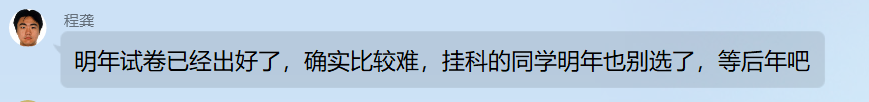

这门课是一门计算机学院的课，是信息与计算科学的平台课，因此不得不品尝

## 课程网站

http://ws.nju.edu.cn/courses/gta

## 教材

这门课在 20级 发生了比较大的变动，增加了许多算法相关的内容

~~课程使用了自制讲义+高随祥《图论与网络流理论》，明年讲义预计将出版，所以课程内容有更多变化也说不准。~~

程龚亲自出的教材，21级是印刷版免费送。22年可能已经出版，需要购买（

## 给分标准

21级评分标准进行了修改，但总体未发生改变。

- 平时成绩40% + 期末**开卷**考试60%
- 其中平时成绩包括
  - 随堂小测（当堂交，9*0.5=4.5）
  - 随堂编程（上机OJ，4*5=205）
  - 书面作业（次周交，9*1.5=13.5）
  - 报告讲稿（制作PPT，1*2=2）
  - 课堂发言（附加分），实测没有什么用（

### 考核具体内容

具体到OJ是基础题（3分）+扩展题（2分），有部分分。随堂小测据说只是起签到作用，不管做的如何还是得及时提交。报告讲稿是论文。书面作业会打分。

OJ可以上网寻找参考资料，编程基础一般的同学建议可以提前了解如何用vector实现邻接表等知识，甚至可以先在luogu等OJ上实现一遍课上的算法。（网上有很多相关算法源码，虽然不鼓励抄袭，但是可以借鉴他们的写法）

开卷考试只允许携带讲义+教材+PPT（带教材就够了）

20级考试组成如下：

1. 一道问答题的大题，包含了7小问，比较繁琐，但是都是比较简单的结论

2. (忘了，欢迎补充)

3. 一道关于联通度的大题，作业原题

4. 实现二分图匹配算法，第一小问是Hungary算法，第二小问是KM算法

5. 实现中国邮递员问题

6. 实现平面嵌入算法

其中所有的实现算法只需要写出算法执行步骤即可。

**注**：21级考试形式和内容相似，所有算法均可以在书上找到。

20级给分情况：平时成绩均分90，卷面均分78，总评均分83

## 作者建议
关于这门课笔者没有很多能给的建议，因为图论和离散数学的重复度比较大，笔者本人没有花太多精力来学习（待补充）

21级补充：理论部分与离散数学中的图论部分重叠非常大，但是额外补充了图论算法的知识。本人体验难度呈一个逐渐增长的趋势，越到后面难度会升高同时课堂提问也会减少。

cg老师的上课风格大概是会提很多问题然后请人回答，回答有平时分加分。笔者认为和zy老师的图论相比，这门课讲课更易懂一些。如果之前图论听的云里雾里，这门课也许能巩固对图论的认识。（易懂十倍甚至九倍）。

## 送给22级

